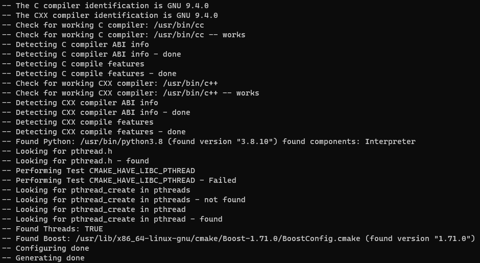
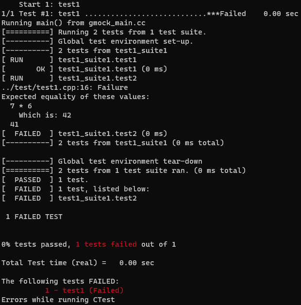
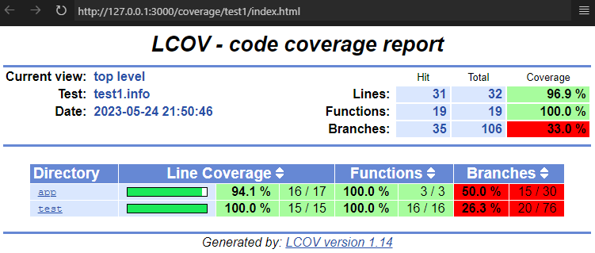

# C++ Boilerplate

C++ Boilerplate using CMake, Boost, OpenCV, Gcov, LCOV, Cppcheck and GTest

## Requirement

- CMake (3.16.3)
- Boost (1.71.0)
- OpenCV (4.2.0)
- g++/Gcov (9.4.0)
- LCOV (1.14)
- Cppcheck (1.90)
- GTest (1.11.0)
- Ninja (1.10.0)

```shell
sudo apt install build-essential libboost-all-dev libopencv-dev cmake ninja-build lcov cppcheck
```

## Generate

```shell
cmake -S . -B build -G Ninja
```



## Build

> Need `Generate` step

```shell
cd build
cmake --build . --target all
```

## Test

> Need `Generate`, `Build` step

```shell
cd build
ctest -j2 --output-on-failure
```



## Coverage

> Need `Generate`, `Build`, `Test` step

``` shell
cd build
cmake --build . --target test1_cov
```


